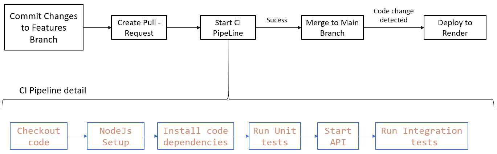
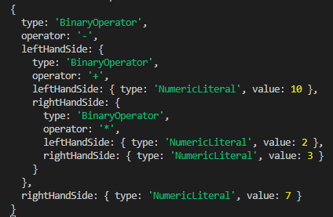
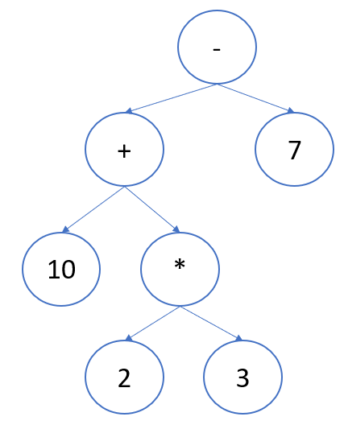

# Calculator-API
This is a simple web service to implement a calculator API (live at [https://calculator-api.onrender.com/](https://calculator-api.onrender.com)). The service offers an endpoint that reads a string input and parses it. The input can be expected to be UTF-8 with BASE64 encoding.


```
# Example
Original query : 2 * (23/(3*3))- 23 * (2*3)
With base64 encoding: MiAqICgyMy8oMyozKSktIDIzICogKDIqMyk=
```

It should return either an HTTP error code, or a solution to the calculation in JSON form

```
Return:

On success: JSON response of format: { "error": false, "result": number }

On error: Either a HTTP error code or: { "error": true, "message": string }
```

Supported operations: + - * / ( )

## Available Scripts

In the project directory, you can run:

### `npm run server`

Runs the app in the development mode at [http://localhost:3000](http://localhost:3000).

When edits are made in the API and saved, the server reloads immediately.

### `npm start`

Runs the app at [http://localhost:3000](http://localhost:3000).

### `npm test`

Launches the unit tests developed. 

## Routes

```
GET /calculus?query=[input]

# Valid Example
GET /calculus?query=MiAqICgyMy8oMyozKSktIDIzICogKDIqMyk=
```
### Live Route Example
[https://calculator-api.onrender.com/calculus?query=MiAqICgyMy8oMyozKSktIDIzICogKDIqMyk=](https://calculator-api.onrender.com/calculus?query=MiAqICgyMy8oMyozKSktIDIzICogKDIqMyk=) 


## CI/CD Pipeline



CI pipeline is triggered when a Pull Request is made.\
CI pipeline processes:
1. Checkout code
2. NodeJs Setup
3. Install code dependencies
4. Run Unit tests
5. Start API
6. Run Integration tests

If all CI pipeline processes are successful, merge can be made to Main Branch. Code change triggers code deploy to Render.

## Code Structure
The code development followed and layered architecture. The components responsibilities are described below:
- **Routes**: layer that receives external requests and directs them to the respective controller;
- **Controller**: layer that receives requests from other systems and forward them to the services. It validates the information received and guarantees only the passage of information in a valid state to the remaining components;
- **DTO** (Data Transfer Objects): An object that stores data transported between processes, reducing the number of method calls required;
- **Services**: contain the business logic and business flow an.
- **Utils**: functions that perform other functionality and that are shared by the services (here we have the _lexer_ (responsible for transforming raw text into a stream of tokens. A token is a single element in a programming language.), _parser_ (main function is to build a syntax tree out of a stream of tokens; _Abstract Syntax Tree_ (AST) was used) and _interpreter_ (place where the actual execution is happening. It reads the AST obtained from the parser and converts it into executable code).

### Abstract Syntax Tree developed
Example for operation _10 + 2 * 3 - 7_



